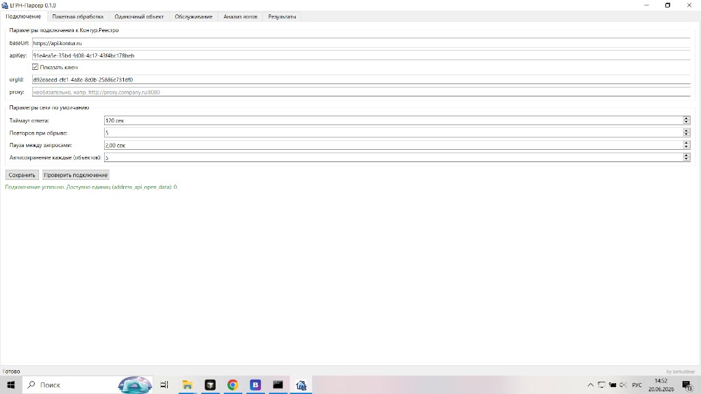
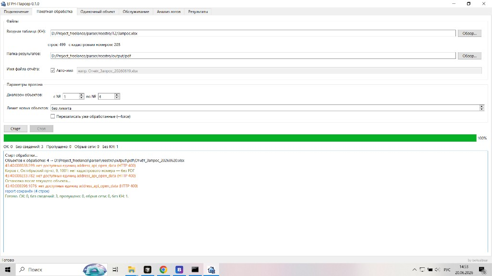
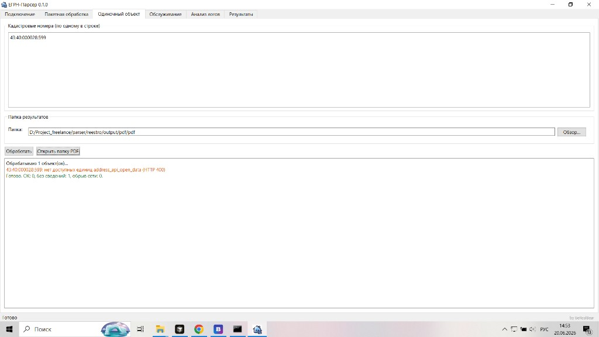
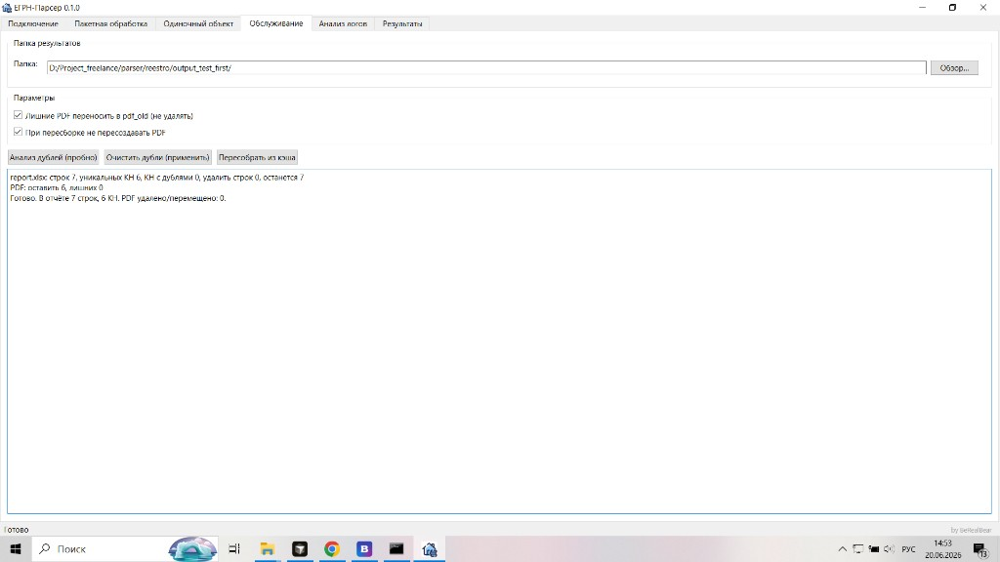
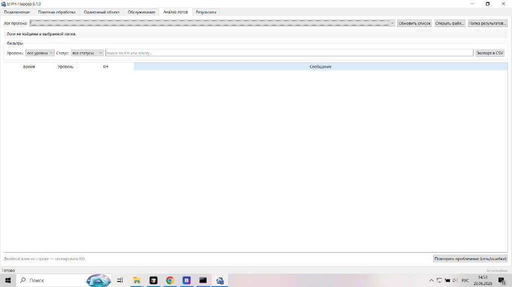

# ЕГРН-Парсер — пошаговая инструкция с разбором экрана

Документ для человека, который **впервые** открывает программу.  
На каждом скриншоте элементы помечены **номерами ① ② ③…** — ищите их на картинке и в таблице под ней.

> Полная справка по сценариям: [`../ИНСТРУКЦИЯ.md`](../ИНСТРУКЦИЯ.md)

---

## Порядок работы (кратко)

```
Шаг 1  Подключение        → ключ API, проверка, сохранить
Шаг 2  Пакетная обработка → таблица + папка output → Старт
Шаг 3  Результаты         → открыть Excel и PDF
Шаг 4  (при ошибках)      → Анализ логов → Повторить проблемные
Шаг 5  (при сбоях report) → Обслуживание → Пересобрать из кэша
```

Дополнительно: **Одиночный объект** — для 1–3 КН вручную, без таблицы.

---

## Шаг 1. Вкладка «Подключение»



| № | Где на экране | Что это | Что делать |
|---|---------------|---------|------------|
| ① | Верхняя строка, первая вкладка | **Подключение** | Открывается при первом запуске — начните здесь |
| ② | Поле **baseUrl** | Адрес API | Оставьте `https://api.kontur.ru` (не менять без IT) |
| ③ | Поле **apiKey** | Ключ API | Вставьте UUID из личного кабинета Контур.Реестро |
| ④ | Галочка «Показать ключ» | Видимость пароля | Включите, чтобы проверить, что ключ скопирован целиком |
| ⑤ | Поле **orgId** | ID организации | UUID организации в Контур.Реестро |
| ⑥ | Поле **proxy** | Прокси | Пусто, если IT не выдал корпоративный прокси |
| ⑦ | **Таймаут / Повторов / Пауза** | Сеть | По умолчанию 120 сек / 5 / 2 сек — для медленной сети можно увеличить |
| ⑧ | **Автосохранение каждые N объектов** | Защита от потери | 5 — report сохраняется каждые 5 новых объектов |
| ⑨ | Кнопка **Сохранить** | Запись настроек | Нажать **после** успешной проверки |
| ⑩ | Кнопка **Проверить подключение** | Тест API | Нажать **до** сохранения |
| ⑪ | Зелёная строка под кнопками | Результат проверки | «Подключение успешно… Доступно единиц: N» |
| ⑫ | Строка состояния внизу слева | Статус программы | «Готово» — можно переходить к обработке |

### ⚠️ Важно по вашему скриншоту

Сообщение **«Доступно единиц: 0»** означает: ключ рабочий, но **баланс API исчерпан**.  
Обработка будет падать с ошибкой `нет доступных единиц address_api_open_data (HTTP 400)` — это видно на скринах пакетной и одиночной обработки.  
**Решение:** пополнить баланс в Контур.Реестро, затем снова **Проверить подключение**.

### 🧪 Упражнение 1 (2 минуты)

1. Вставьте apiKey и orgId.
2. Нажмите **⑩ Проверить подключение**.
3. Если единиц > 0 — нажмите **⑨ Сохранить**.
4. Перейдите на вкладку **Пакетная обработка**.

---

## Шаг 2. Вкладка «Пакетная обработка» (основная работа)



| № | Где на экране | Что это | Что делать |
|---|---------------|---------|------------|
| ① | Вторая вкладка сверху | **Пакетная обработка** | Основной режим: таблица → PDF + Excel |
| ② | **Входная таблица (КН)** + **Обзор…** | Файл с номерами | Выберите `Запрос.xlsx` (или свой CSV/XLSX) |
| ③ | Строка под таблицей | Статистика файла | `строк: 499   с кадастровым номером: 285` — сколько объектов в файле |
| ④ | **Папка результатов** + **Обзор…** | Куда складывать всё | ⚠️ **Корень output**, напр. `D:\...\reestro\output` |
| ⑤ | **Авто-имя** + поле имени | Имя Excel-отчёта | Включено → `Отчёт_Запрос_20260620.xlsx` |
| ⑥ | **Диапазон объектов** с № / по № | Часть файла | Для теста: **с 1 по 4** (как на скрине) |
| ⑦ | **Лимит новых объектов** | Партия за раз | «Без лимита» или, напр., 20 |
| ⑧ | **Перезаписать уже обработанные** | --force | Обычно **выключено** — готовые объекты пропускаются |
| ⑨ | **Старт** / **Стоп** | Запуск / остановка | Стоп — после текущего объекта, не мгновенно |
| ⑩ | Зелёная полоса | Прогресс | 100% — прогон завершён |
| ⑪ | Строка счётчиков | Итог | OK / Без сведений / Пропущено / Обрыв сети / Без КН |
| ⑫ | Большое окно внизу | Журнал прогона | Подробности по каждому КН; оранжевое = ошибка API |

### ⚠️ Ошибка на вашем скрине — папка результатов

На скрине указано: `...\output\pdf` — это **неправильно**.

| Выбрали | Что получится |
|---------|---------------|
| `output\pdf` ❌ | PDF в `output\pdf\pdf\`, отчёт не там |
| `output` ✅ | PDF в `output\pdf\`, отчёт в `output\Отчёт_....xlsx` |

**Правильно:** `D:\Project_freelance\parser\reestro\output`

### 🧪 Упражнение 2 — пробный прогон (5 минут)

> Нужен баланс API > 0. Если единиц 0 — сначала упражнение 1.

1. **②** → Обзор → `TZ\Запрос.xlsx`.
2. **④** → Обзор → создайте или выберите `...\reestro\output` (**не pdf!**).
3. **⑥** → с **1** по **4** (четыре объекта для теста).
4. **⑨ Старт** → дождитесь 100%.
5. Откройте папку `output\pdf\` — там должны появиться PDF (если API вернул данные).
6. Откройте `output\Отчёт_Запрос_YYYYMMDD.xlsx`.

**Что означает лог на скрине:**

| Текст в логе | Значение |
|--------------|----------|
| `нет доступных единиц… HTTP 400` | Нет баланса API — не ошибка программы |
| `нет кадастрового номера — без PDF` | В строке таблицы пустой КН — норма |
| `report сохранён (4 строк)` | Excel записан (даже при ошибках API) |

---

## Шаг 3. Вкладка «Одиночный объект»



| № | Где | Что это | Что делать |
|---|-----|---------|------------|
| ① | Третья вкладка | **Одиночный объект** | Без таблицы — КН вручную |
| ② | Большое поле ввода | Список КН | По одному номеру в строке: `43:40:000028:599` |
| ③ | **Папка** + **Обзор…** | Папка результатов | Та же **output**, что в пакетной (не `pdf\pdf\`!) |
| ④ | **Обработать** | Запуск | Запросить API по введённым КН |
| ⑤ | **Открыть папку PDF** | Быстрый доступ | Открывает `output\pdf\` в проводнике |
| ⑥ | Журнал внизу | Результат | Оранжевое = ошибка; зелёное «Готово» = прогон завершён |

Имя отчёта берётся с вкладки **Пакетная обработка** (поле «Имя файла отчёта»).

### 🧪 Упражнение 3 (3 минуты)

1. Исправьте **③** на `...\reestro\output`.
2. Введите один известный КН.
3. **④ Обработать**.
4. **⑤ Открыть папку PDF** — проверьте новый файл.

---

## Шаг 4. Вкладка «Обслуживание»



| № | Где | Что это | Что делать |
|---|-----|---------|------------|
| ① | Четвёртая вкладка | **Обслуживание** | Без API — порядок в report и PDF |
| ② | **Папка** + **Обзор…** | Корень output | Напр. `output_test_first` — где есть `cache\json\` |
| ③ | Строка под папкой | Проверка кэша | «JSON-кэш: N файлов» — должно быть N > 0 |
| ④ | Галочка **pdf_old** | Безопасность | Лишние PDF **переносятся**, не удаляются |
| ⑤ | Галочка **не пересоздавать PDF** | При пересборке | Оставить включённой, если PDF уже есть |
| ⑥ | **Анализ дублей (пробно)** | Просмотр | Ничего не меняет |
| ⑦ | **Очистить дубли (применить)** | Исправление | Убирает дубли КН и лишние PDF |
| ⑧ | **Пересобрать из кэша** | Восстановление | Excel из `cache\json\` **без запросов к API** |
| ⑨ | Журнал внизу | Результат | «Готово. В отчёте 7 строк, 6 КН…» |

### 🧪 Упражнение 4 (5 минут)

На папке `output_test_first` (как на скрине):

1. **②** → укажите `output_test_first`.
2. Убедитесь: **③** «JSON-кэш: 6 файлов» (или больше).
3. **⑥ Анализ дублей** — посмотрите цифры.
4. **⑧ Пересобрать из кэша** — report обновится без API.

---

## Шаг 5. Вкладка «Анализ логов»



| № | Где | Что это | Что делать |
|---|-----|---------|------------|
| ① | Пятая вкладка | **Анализ логов** | Разбор прошлых прогонов |
| ② | **Лог прогона** (выпадающий список) | Файл `run_....jsonl` | Выберите последний прогон |
| ③ | **Обновить список** | Обновление | После нового прогона |
| ④ | **Открыть файл…** | Вручную | Если лог не в списке |
| ⑤ | **Папка результатов…** | Привязка к output | Укажите корень output — подтянутся логи из `logs\` |
| ⑥ | **Уровень / Статус / Поиск** | Фильтры | Найти «Обрыв сети», конкретный КН |
| ⑦ | Таблица | События | Двойной клик — **КН в буфер обмена** |
| ⑧ | **Экспорт в CSV** | Отчёт IT | Отправить исполнителю |
| ⑨ | **Повторить проблемные** | Догон | Только объекты с сетью/ошибками |

### ⚠️ «Логи не найдены»

На скрине логов нет, потому что:

- указана папка `output\pdf\pdf\` (логи лежат в `output\logs\`), или
- прогон ещё не создавал `logs\run_....jsonl`.

**Решение:** **⑤ Папка результатов…** → выберите `...\reestro\output` → **③ Обновить список**.

### 🧪 Упражнение 5 (после упражнения 2)

1. **⑤** → `...\reestro\output`.
2. **③ Обновить список** → выберите последний лог.
3. В фильтре **Статус** выберите ошибки.
4. Если есть обрывы сети — **⑨ Повторить проблемные**.

---

## Шаг 6. Вкладка «Результаты»

| Элемент | Назначение |
|---------|------------|
| Карточки (Всего / OK / Без сведений…) | Сводка **последнего** прогона |
| Строка «Отчёт: путь…» | Полный путь к Excel |
| **Открыть …xlsx** | Открыть отчёт в Excel |
| **Открыть папку результатов** | Проводник с папкой отчёта |

Появляется автоматически после **Старт** (пакет) или **Обработать** (одиночный).

---

## Схема: куда что попадает

```
Вы указали:  D:\...\reestro\output     ← корень (поле «Папка результатов»)
                    │
    ┌───────────────┼───────────────┬──────────────┐
    ▼               ▼               ▼              ▼
Отчёт_....xlsx   pdf\          cache\json\     logs\
(Excel)          (PDF файлы)   (кэш API)       (журналы)
```

**Не указывайте** `output\pdf` — иначе структура «съедет» (как на ваших скринах).

---

## Типовой день пользователя (чек-лист)

- [ ] Подключение → баланс > 0 → Сохранить
- [ ] Пакетная → таблица + **корень output** → Старт
- [ ] Excel закрыт во время работы
- [ ] Результаты → открыть отчёт
- [ ] При ошибках → Анализ логов → Повторить проблемные
- [ ] При беспорядке в report → Обслуживание → Пересобрать из кэша

---

## Частые вопросы по вашим скринам

| Вопрос | Ответ |
|--------|-------|
| Почему HTTP 400 «нет единиц»? | Баланс API = 0 на вкладке Подключение |
| Почему `output\pdf\pdf\`? | В поле папки выбрали `pdf` вместо корня `output` |
| Почему логи не находятся? | Та же причина — неверная папка; логи в `output\logs\` |
| Почему report называется «Отчёт_Запрос_…»? | Включено **Авто-имя** на пакетной вкладке |
| Нужно ли каждый раз новую папку? | **Нет** — одна папка output на весь проект |

---

*Версия: 0.1.0 · ЕГРН-Парсер · by BeRealBear*
